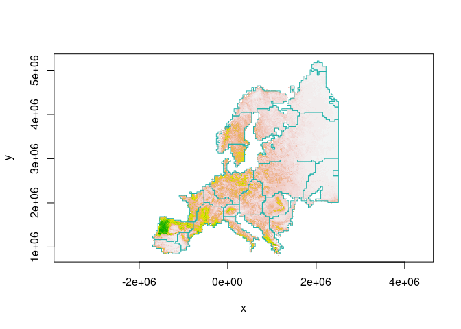

<!-- README.md is generated from README.Rmd. Please edit that file -->

# habCluster

<!-- badges: start -->
<!-- badges: end -->

Based on landscape connectivity, use Community Detection Algorithm to
find structure of raster and return a polygon representing the boundary
of the clusters.

## Installation

You can install the development version of habCluster from
[GitHub](https://github.com/) with:

``` r
# install.packages("devtools")
devtools::install_github("qiangxyz/habCluster")
```

## Example

This is a basic example which shows you how to find the cluster of
lands:

``` r
library(sf)
library(raster)
library(habCluster)
```

Read in habitat suitability index (HSI) data of wolf in Europe. The HSI
values of the cells in the raster indicate how smoothly the wolfs can
moved in the cells, and can be used to represent the connection between
cells as habitat. The original value of HSI was 0 - 1.0 (float), yet was
transformed to integers from 0 - 100 for reducing the file size.

``` r
hsi.file = system.file("extdata","wolf3_int.tif",package="habCluster")
wolf = raster(hsi.file)
# rescale raster value to 0 - 1
wolf = wolf / 100
```

Find habitat cluster using Leiden Algorithm. Raster for habitat
suitability will be resampled to 40 km (40000 m), to reduce calculation
amount. Set resolution_parameter to 0.0002 to control the cluster size.
Note that the parameter of cellsize controls the spatial scale analysis
is performed, while the parameter of resolution_parameter is used to
control cluster size.

``` r
clst = cluster(wolf, method = cluster_leiden, cellsize = 40000, resolution_parameter = 0.0002, silent = FALSE)
#> 
#> resampling...
#> extracting edges...
#> create graph...
#> finding clusters...
#> preparing results...
```

We can also embed plots, for example:

``` r
image(wolf, col = terrain.colors(100,rev = T), asp = 1)
boundary = clst$boundary
plot( boundary$geometry, add=TRUE, asp=1, border = "lightseagreen")
```


Or, we can discard small patches before plotting:

``` r
image(wolf, col = terrain.colors(100,rev = T), asp = 1)
boundary$area = as.numeric(st_area(boundary))
boundary = boundary[boundary$area > 40000*40000,]
plot(boundary$geometry, add=TRUE, asp=1, border = "lightseagreen")
```


Using stars to manipulate the raster will make the computation more
quick:

``` r
hsi.file = system.file("extdata","wolf3_int.tif",package="habCluster")
wolf = read_stars(hsi.file)
wolf = wolf / 100
clst = cluster(wolf, method = cluster_leiden, cellsize = 40000, resolution_parameter = 0.0002, silent = FALSE)
#> 
#> resampling...
#> extracting edges...
#> create graph...
#> finding clusters...
#> preparing results...
```

Leiden algorithm is not greedy, therefore the clusters are somehow
random. We can use the Fast Greedy algorithm to avoid random results:

``` r
wolf = raster(hsi.file) / 100
clst = cluster(wolf, method = cluster_fast_greedy, cellsize = 40000)
```

``` r
image(wolf, col = terrain.colors(100,rev = T), asp = 1)
boundary = clst$boundary
plot( boundary$geometry, add=TRUE, asp=1, border = "lightseagreen")
```



## How to Cite

Zhang,C., J. Li, B. Yang, Q. Dai\*. (2022). habCluster: Identifying
Geographical Boundary among Intraspecific Units Using Community
Detection Algorithm in R. bioRxiv 2022.05.06.490926.
