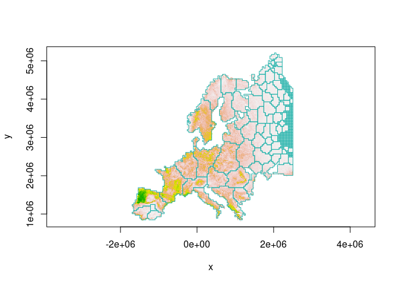
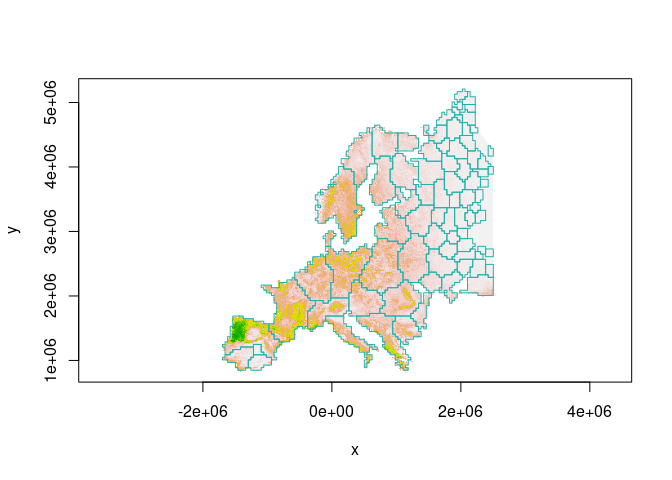

<!-- README.md is generated from README.Rmd. Please edit that file -->

# habCluster

<!-- badges: start -->
<!-- badges: end -->

Based on landscape connectivity, use Community Detection Algorithm to
find structure of raster and return a polygon representing the boundary
of the clusters.

## Installation

You can install the development version of habCluster from
[GitHub](https://github.com/) with:

``` r
# install.packages("devtools")
devtools::install_github("qiangxyz/habCluster")
```

## Example

This is a basic example which shows you how to find the cluster of
lands:

``` r
library(sf)
library(raster)
library(habCluster)
library(dplyr)
```

Read in habitat suitability index (HSI) data of wolf in Europe. The HSI
values of the cells in the raster indicate how smoothly the wolfs can
moved in the cells, and can be used to represent the connection between
cells as habitat.

``` r
hsi.file = system.file("extdata","wolf3_int.tif",package="habCluster")
wolf = raster(hsi.file)
```

Find habitat cluster using Leiden Algorithm. Raster for habitat
suitability will be resampled to 40 km (40000 m), to reduce calculation
amount. Set cluster_resolution_parameter to 0.02 to control the cluster
size. Note that the parameter of cellsize controls the spatial scale
analysis is performed, while the parameter of rp is used to control
cluster size.

``` r
clst = cluster(wolf, method = cluster_leiden, cellsize = 40000, rp = 0.02, silent = FALSE)
#> 
#> resampling...
#> extracting edges...
#> create graph...
#> finding clusters...
#> preparing results...
```

We can also embed plots, for example:

``` r
image(wolf, col = terrain.colors(100,rev = T), asp = 1)
boundary = clst$boundary
plot( boundary$geometry, add=TRUE, asp=1, border = "lightseagreen")
```



Or, we can discard small patches before plotting:

``` r
image(wolf, col = terrain.colors(100,rev = T), asp = 1)
boundary$area = st_area(boundary)%>%as.numeric
boundary = boundary %>% filter(area > 40000*40000)
plot( boundary$geometry, add=TRUE, asp=1, border = "lightseagreen")
```



Using stars to manipulate the raster will make the computation more
quick:

``` r
hsi.file = system.file("extdata","wolf3_int.tif",package="habCluster")
wolf = read_stars(hsi.file)
clst = cluster(wolf, method = cluster_leiden, cellsize = 40000, rp = 0.02, silent = FALSE)
#> 
#> resampling...
#> extracting edges...
#> create graph...
#> finding clusters...
#> preparing results...
```

## How to Cite

Zhang, C., Q. Dai\*, et al, (in review). Identifying Geographical
Boundary among Intraspecific Units Using Community Detection Algorithm.
